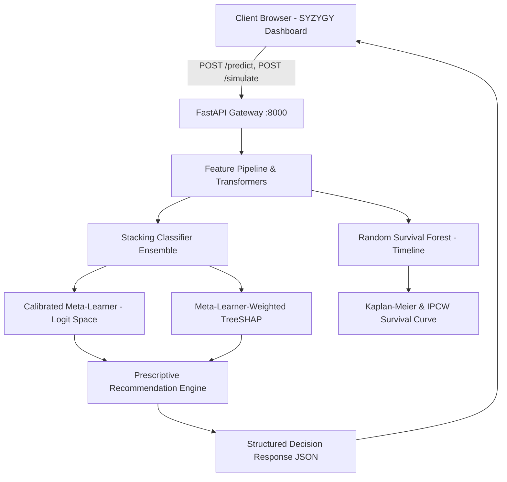

# System Architecture
## Project: SYZYGY Topology & Flow

### Subagent Responsibilities
- **Inference Pipeline:** Executes feature scaling, derivation of statutory clearance risk scores, and ensemble inference in <25ms.
- **XAI Decomposition:** Computes signed local SHAP impacts, aligns categorical attributions, and provides plain-English executive summaries.
- **What-If Simulation:** Isolates counterfactual modifications and calculates schedule drift avoided.
