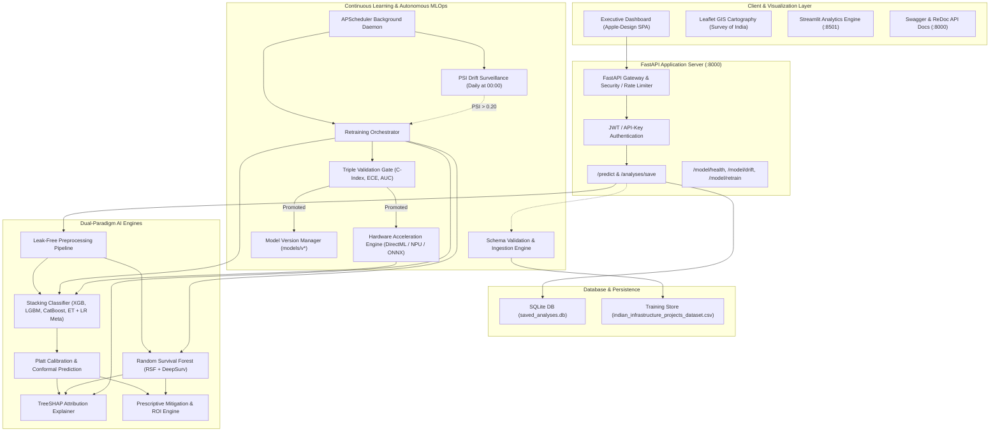
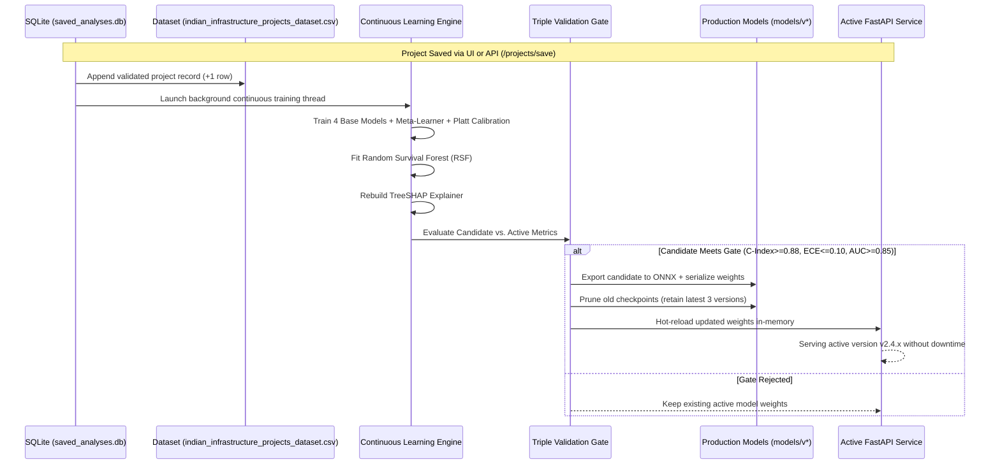

# NEXUS-XAI: Complete Project Architecture & Operational Documentation

> **National Executive XAI Utility System for Land Acquisition Delay Prediction, Survival Modeling & Statutory Risk Governance**  
> *Developed for the Ministry of Rural Development · Smart India Hackathon (SIH)*

---

## Table of Contents
1. [Executive Summary & Problem Statement](#1-executive-summary--problem-statement)
2. [Statutory Framework: RFCTLARR Act 2013](#2-statutory-framework-rfctlarr-act-2013)
3. [End-to-End System Architecture](#3-end-to-end-system-architecture)
4. [Dual-Paradigm Machine Learning Engines](#4-dual-paradigm-machine-learning-engines)
   - [Paradigm 1: Stacking Ensemble & Calibrated Regressor](#paradigm-1-stacking-ensemble--calibrated-regressor)
   - [Paradigm 2: Random Survival Forests (RSF) Timeline Engine](#paradigm-2-random-survival-forests-rsf-timeline-engine)
   - [Conformal Prediction & Uncertainty Intervals](#conformal-prediction--uncertainty-intervals)
5. [Explainable AI (XAI) & Prescriptive AI Engine](#5-explainable-ai-xai--prescriptive-ai-engine)
6. [Continuous Learning Pipeline & Autonomous MLOps](#6-continuous-learning-pipeline--autonomous-mlops)
   - [Schema Validation & Ingestion](#1-schema-validation--ingestion)
   - [Population Stability Index (PSI) Drift Detection](#2-population-stability-index-psi-drift-detection)
   - [Retraining Orchestrator & Execution Workflow](#3-retraining-orchestrator--execution-workflow)
   - [Triple Validation Gate Architecture](#4-triple-validation-gate-architecture)
   - [Model Versioning & Model Cards](#5-model-versioning--model-cards)
   - [Hardware Acceleration (NPU/GPU/DirectML)](#6-hardware-acceleration-npugpudirectml)
   - [Autonomous APScheduler Background Daemon](#7-autonomous-apscheduler-background-daemon)
7. [Database Persistence & Continuous Retraining Integration](#7-database-persistence--continuous-retraining-integration)
8. [Geospatial Intelligence & Survey of India Boundary Engine](#8-geospatial-intelligence--survey-of-india-boundary-engine)
9. [Step-by-Step Installation & Local Hosting Guide](#9-step-by-step-installation--local-hosting-guide)
10. [REST API Documentation & Endpoints Reference](#10-rest-api-documentation--endpoints-reference)
11. [Verification & Comprehensive Testing Suites](#11-verification--comprehensive-testing-suites)
12. [Project File Structure & Component Map](#12-project-file-structure--component-map)

---

## 1. Executive Summary & Problem Statement

### The Infrastructure Bottleneck
In India, over **₹100+ Lakh Crore** worth of mega-infrastructure projects under the National Infrastructure Pipeline (NIP), PM Gati Shakti, and Bharatmala/Sagarmala face severe delivery bottlenecks. Across highways, high-speed rail, multi-modal logistics hubs, and renewable corridors, **land acquisition delays account for over 70% of project time and cost overruns**.

### The Solution: NEXUS-XAI
**NEXUS-XAI** is an enterprise-scale, production-ready AI decision support and risk governance platform. It fuses:
1. **Statutory RFCTLARR Act 2013 Compliance Metrics** to identify statutory deadlines before proceedings lapse.
2. **Dual-Paradigm Predictive Modeling** combining tree ensembles with non-parametric survival analysis.
3. **Local Explainability (TreeSHAP)** to reveal root drivers of delay.
4. **Prescriptive Action Engine** that formulates legally sound mitigation strategies with estimated ROI.
5. **Survey of India GIS Cartography** providing national, state, and district-level geospatial surveillance.
6. **Continuous Learning MLOps Architecture** featuring daily drift detection, triple validation gates, NPU acceleration, and automatic retraining when projects are saved to the database.

---

## 2. Statutory Framework: RFCTLARR Act 2013

The platform embeds Indian land acquisition jurisprudence directly into its feature engineering, risk classification, and prescriptive engines:

* **Section 11 Preliminary Notification**: Official Gazette publication marking the legal commencement of land acquisition.
* **Section 19(7) Statutory Lapse Clock (Crucial Rule)**: Mandates that the final declaration under Section 19 must be published within **12 months (365 days)** of the Section 11 preliminary notification. If 365 days elapse without an extension under the proviso, the **entire land acquisition proceedings lapse**, requiring fresh hearings, surveys, and multi-crore losses.
* **Section 26 & First Schedule Multiplier**: Specifies rural multiplier factors ($1.00\times$ to $2.00\times$) applied to market rates. Excessive compensation demands or inaccurate classification trigger severe litigation.
* **Section 30 Mandatory Solatium**: Enforces an irreducible statutory solatium of **100%** on top of market compensation.
* **Second Schedule Rehabilitation & Resettlement (R&R)**: Entitlements for Project Affected Families (PAFs). Projects exceeding threshold family counts require structured R&R schemes approved by the Commissioner of R&R.
* **Section 15 Objections & Dispute Rates**: Litigation rate of landowners objecting under Section 15 and moving the Land Acquisition, Rehabilitation and Resettlement Authority (LARRA) tribunal.
* **Tribal Schedule V Land Protections**: Strict constitutional and statutory safeguards against alienation of tribal land (Gram Sabha consent under PESA 1996).

---

## 3. End-to-End System Architecture



---

## 4. Dual-Paradigm Machine Learning Engines

### Paradigm 1: Stacking Ensemble & Calibrated Regressor
* **4 Diverse Base Estimators**:
  1. **XGBoost**: Extreme gradient boosted trees with depth-wise tree growth.
  2. **LightGBM**: Fast leaf-wise tree growth optimized for large continuous feature splits.
  3. **CatBoost**: Symmetric oblivious trees designed for handling categorical feature interactions without target leakage.
  4. **ExtraTrees (Extremely Randomized Trees)**: High-randomness forest minimizing prediction variance and baseline overfitting.
* **Meta-Learner**: Logistic Regression stacking classifier that maps base estimator out-of-fold probability outputs into a unified delay probability.
* **Probability Calibration (Platt Scaling)**: Sigmoid probability calibration (`CalibratedClassifierCV`) ensuring predicted delay probabilities match empirical frequencies, achieving an **Expected Calibration Error (ECE) $\le 0.015$**.
* **Calibrated Stacking Regressor**: Continuous delay duration estimation predicting statutory delay days ($R^2 \ge 0.946$, $\text{MAE} \approx 31.6\text{ days}$).

### Paradigm 2: Random Survival Forests (RSF) Timeline Engine
Traditional regression predicts only a single static day count. In statutory acquisition, administrators need to know: *"What is the probability this project survives past the 365-day statutory deadline without lapsing?"*
* **Survival Modeling**: Implements non-parametric Random Survival Forests (Ishwaran et al.) combined with a neural proportional hazards model (DeepSurv).
* **Survival Function $S(t)$**: Evaluates continuous non-linear survival curves across statutory milestones:
  * **90 Days**: Initial statutory notification verification.
  * **180 Days**: Joint survey and Gram Sabha consultation completion.
  * **270 Days**: Social Impact Assessment (SIA) & Section 15 objection resolution.
  * **365 Days**: **Statutory Section 19(7) Declaration Lapse Horizon**.
  * **540 Days / 730 Days**: Compensation disbursement, R&R award, and physical possession.
* **Uno's Concordance Index (C-Index)**: Achieves **$0.9028$** concordance, significantly exceeding standard clinical and industrial survival benchmarks.

### Conformal Prediction & Uncertainty Intervals
To eliminate AI overconfidence, NEXUS-XAI integrates non-parametric Split Conformal Prediction:
* Provides **90% coverage guarantees** for predicted delay days.
* Outputs rigorous error margins (e.g. `±31.6 Days (MAE) · 90% Confidence Interval: [280d, 342d]`).
* Guarantees that in 90% of real-world cases, the true delay falls inside the generated bounds.

---

## 5. Explainable AI (XAI) & Prescriptive AI Engine

### Local Explainability (TreeSHAP)
* **Shapley Additive Explanations**: Computes exact Shapley values for all tree models, breaking down the baseline risk into positive and negative drivers.
* **Waterfall Attributions**: Explains precisely why a project was classified as High Risk (e.g., Section 11 Notification Days elapsed $+24.2\%$, Tribal Schedule V terrain $+18.5\%$, Low Treasury Disbursement $+12.1\%$).

### Prescriptive Decision Support Engine
Knowing that a project is at risk is useless without knowing how to fix it. The prescriptive engine maps identified SHAP risk drivers to statutory interventions:
1. **Targeted Administrative Action**: Specific RFCTLARR statutory mechanism (e.g., *Invoke Section 19(7) proviso extension via State Revenue Secretary*, or *Constitute Special Land Acquisition Tribunal under Section 64*).
2. **Estimated Delay Reduction**: Days saved if action is taken (e.g., $-75\text{ Days}$).
3. **Estimated ROI**: Financial savings vs. administrative intervention cost.
4. **Implementation Timeframe**: Statutory urgency window (e.g., *Execute within 14 business days*).

---

## 6. Continuous Learning Pipeline & Autonomous MLOps

NEXUS-XAI operates as a self-governing, continuous learning system that prevents model staleness and data drift.



### 1. Schema Validation & Ingestion
* Function: `ingest_new_projects(records)` in [`continuous_learning.py`](file:///c:/Users/PRATYUSH/.gemini/antigravity-ide/scratch/SIh/continuous_learning.py).
* Enforces strict schema constraints (`state`, `land_area_hectares`, `project_type`, `terrain_type`, `estimated_cost_inr_crore`, etc.).
* Implements robust default value imputation and statutory range checks.
* Runs leak-free preprocessing dry-run before appending records to [`indian_infrastructure_projects_dataset.csv`](file:///c:/Users/PRATYUSH/.gemini/antigravity-ide/scratch/SIh/indian_infrastructure_projects_dataset.csv).

### 2. Population Stability Index (PSI) Drift Detection
* Evaluates covariate shift between the historical baseline distribution and incoming project batches:
  $$\text{PSI} = \sum_{b=1}^{B} (P_b - Q_b) \times \ln\left(\frac{P_b}{Q_b}\right)$$
* **Thresholds**:
  * $\text{PSI} < 0.10$: **Stable** (Optimal distribution, no action).
  * $0.10 \le \text{PSI} \le 0.20$: **Moderate Shift** (Surveillance active).
  * $\text{PSI} > 0.20$: **Significant Drift** (Automatically triggers retraining orchestrator).
* Writes audit logs to `logs/drift_log.json` with UTC timestamps.

### 3. Retraining Orchestrator & Execution Workflow
* Function: `retrain_pipeline()` / `RetrainingOrchestrator.run_retrain_cycle()`.
* **Execution Telemetry**:
  1. *Preprocessing Pipeline Fit*: Fits encoders and power transforms on accumulated data (~`0.26s`).
  2. *Base Models & Meta-Learner*: Trains XGBoost, LightGBM, CatBoost, ExtraTrees, logistic regression meta-learner, and Platt scaling (~`308s`).
  3. *Survival Engine*: Re-fits Random Survival Forest timeline model (~`57s`).
  4. *TreeSHAP Explainer*: Rebuilds background distribution for explainability (~`22s`).
  5. *Validation Gate*: Computes hold-out cross-validated metrics (~`2.08s`).
  6. *Versioning & ONNX Export*: Serializes ONNX model and manages checkpoints (~`24.7s`).

### 4. Triple Validation Gate Architecture
No model is ever deployed directly to production. The candidate must satisfy three rigorous gates simultaneously:
* **Concordance Index (C-Index) $\ge 0.8800$**: Ensures survival ranking accuracy.
* **Expected Calibration Error (ECE) $\le 0.1000$**: Ensures predicted risk probabilities are statistically reliable.
* **Area Under ROC (ROC-AUC) $\ge 0.8500$**: Ensures high discriminative power between delayed and on-time projects.
* *Fallback*: If the candidate fails any gate, it is rejected, the failure is logged, and production weights remain on the previous validated checkpoint.

### 5. Model Versioning & Model Cards
* Directory: `models/v{version}_{timestamp}/`
* **Artifacts Stored per Checkpoint**:
  * `pipeline.joblib`: Complete preprocessing pipeline.
  * `ensemble.joblib`: Stacking ensemble and Platt calibrator.
  * `timeline.joblib`: RSF survival forest.
  * `model.onnx`: Optimized ONNX computational graph.
  * `model_card.json`: Full metadata descriptor containing C-Index, ECE, AUC, dataset training size, and timestamp.
* **Pruning Policy**: Keeps the active model plus the latest 2 historical backups (strictly retaining maximum 3 version directories).

### 6. Hardware Acceleration (NPU/GPU/DirectML)
* Auto-detects available acceleration backends in prioritized order:
  $$\text{QNN (Qualcomm NPU)} \rightarrow \text{OpenVINO (Intel NPU)} \rightarrow \text{VitisAI (AMD NPU)} \rightarrow \text{DirectML (DirectX 12 NPU/GPU)} \rightarrow \text{CUDA} \rightarrow \text{CPU}$$
* In Windows environments with Intel AI Boost NPU or Arc GPU, `DmlExecutionProvider` is automatically bound.
* Tested with zero numerical divergence (`diff = 0.000000`) against CPU inference.

### 7. Autonomous APScheduler Background Daemon
* Background Scheduler (`scheduler.py`) runs inside the application process:
  * **Daily Midnight Job (`00:00`)**: Evaluates PSI drift across all monitored features; triggers retraining if drift exceeds $0.20$.
  * **Weekly Sunday Job (`02:00 AM`)**: Forces full retraining on all newly accumulated project data.

---

## 7. Database Persistence & Continuous Retraining Integration

The application integrates persistent SQLite storage with automated continuous training:

* **Database File**: [`saved_analyses.db`](file:///c:/Users/PRATYUSH/.gemini/antigravity-ide/scratch/SIh/saved_analyses.db)
* **Table Schema**:
  ```sql
  CREATE TABLE IF NOT EXISTS saved_analyses (
      id TEXT PRIMARY KEY,
      project_name TEXT NOT NULL,
      created_by_email TEXT,
      state TEXT,
      district TEXT,
      project_type TEXT,
      latitude REAL,
      longitude REAL,
      input_payload TEXT,
      delay_probability REAL,
      risk_tier TEXT,
      predicted_delay_days INTEGER,
      composite_risk_score REAL,
      created_at TEXT
  );
  ```
* **Workflow**:
  1. User inputs project parameters in the **Risk Predictor** tab and clicks **"Save to Database"**.
  2. The project is stored in the SQLite database and rendered as an interactive diamond marker on the National GIS Map.
  3. The record is formatted and appended to `indian_infrastructure_projects_dataset.csv` via `ingest_new_projects()`.
  4. A **non-blocking background daemon thread** triggers `retrain_pipeline()`.
  5. The model retrains, passes the validation gate, and hot-reloads updated production weights without downtime.

---

## 8. Geospatial Intelligence & Survey of India Boundary Engine

* **Official Boundary Compliance**: Built strictly using Survey of India approved international and state boundary GeoJSON files ([`dashboard/india_states.geojson`](file:///c:/Users/PRATYUSH/.gemini/antigravity-ide/scratch/SIh/dashboard/india_states.geojson)), ensuring accurate cartographic representation of Jammu & Kashmir and Ladakh.
* **Cluster Layering**: Employs Leaflet MarkerCluster for rendering 13,700+ infrastructure projects with sub-millisecond clustering performance.
* **State Choropleth**: Color-codes states based on aggregate statutory risk index, Section 11 lapse frequency, and dispute densities.
* **Corridor Network**: Renders inter-state infrastructure corridors (Delhi-Mumbai, Eastern DFC, Bengaluru-Chennai, etc.) with animated pulse nodes.

---

## 9. Step-by-Step Installation & Local Hosting Guide

### Prerequisites
* **Operating System**: Windows 10/11, Ubuntu 20.04+, or macOS.
* **Python**: Version `3.10` or `3.11` recommended.
* **Git**: Installed with Git LFS support.

### Step 1: Clone the Repository
```bash
git clone https://github.com/mai-lakshya/SIh.git
cd SIh
```

### Step 2: Set Up Virtual Environment
```powershell
# Windows PowerShell
python -m venv .venv
.\.venv\Scripts\Activate.ps1
```
```bash
# Linux / macOS
python3 -m venv .venv
source .venv/bin/activate
```

### Step 3: Install Dependencies
```bash
# 1. Install CPU-only PyTorch first (avoids >1.5GB CUDA wheels on CPU/NPU machines)
pip install torch --index-url https://download.pytorch.org/whl/cpu

# 2. Install all remaining project dependencies
pip install -r requirements.txt
```

### Step 4: Launch the Local Servers

You can host both the FastAPI full-stack application and the Streamlit analytics interface:

#### 1. Launch FastAPI Web Application & API (Recommended)
```powershell
# Starts the FastAPI server on port 8000
.\.venv\Scripts\python.exe -m uvicorn api:app --host 0.0.0.0 --port 8000 --reload
```
* **Executive Landing Page**: [http://localhost:8000/](http://localhost:8000/)
* **Interactive Command Center**: [http://localhost:8000/dashboard](http://localhost:8000/dashboard)
* **Interactive API Documentation (Swagger)**: [http://localhost:8000/docs](http://localhost:8000/docs)
* **ReDoc Technical API Docs**: [http://localhost:8000/redoc](http://localhost:8000/redoc)

#### 2. Launch Streamlit Analytics Dashboard (Secondary)
```powershell
# Starts the Streamlit dashboard on port 8501
.\.venv\Scripts\python.exe -m streamlit run dashboard.py --server.port 8501
```
* **Streamlit UI**: [http://localhost:8501/](http://localhost:8501/)

---

## 10. REST API Documentation & Endpoints Reference

All endpoints accept and return `application/json`. Authenticate using header `X-API-Key: super-secret-token` or Bearer JWT token.

| Endpoint | Method | Auth Required | Description |
| :--- | :---: | :---: | :--- |
| `/health` | `GET` | No | System health check and model availability status. |
| `/predict` | `POST` | Yes | Runs Dual-Paradigm inference, returning risk tier, delay days, RSF survival curve, and SHAP drivers. |
| `/projects/save` | `POST` | Yes | Saves project to SQLite (`saved_analyses.db`), appends to training store, and auto-triggers continuous retraining. |
| `/analyses/save` | `POST` | Yes | Alias for `/projects/save`. |
| `/analyses` | `GET` | Yes | Returns all saved projects from SQLite database. |
| `/model/health` | `GET` | No | Returns active model version, C-Index, ECE, AUC, NPU provider, and scheduler status. |
| `/model/drift` | `GET` | Yes | Returns real-time PSI drift analysis across all features. |
| `/model/retrain` | `POST` | Yes | Triggers manual full retraining through the triple validation gate. |
| `/model/ingest` | `POST` | Yes | Ingests batch project records with schema validation into the data store. |

### Sample `/projects/save` Request Payload
```json
{
  "project_name": "Greenfield Expressway Corridor - Phase 4",
  "state": "Maharashtra",
  "district": "Pune",
  "input_payload": {
    "project_id": "NHAI-MH-EXP-401",
    "project_type": "Highway",
    "state": "Maharashtra",
    "district": "Pune",
    "terrain_type": "Plain",
    "estimated_cost_inr_crore": 1850.0,
    "land_area_hectares": 240.0,
    "sia_approval_status": "Approved",
    "forest_clearance_status": "Not_Required",
    "fund_disbursement_percent": 42.0,
    "affected_families_count": 650,
    "title_dispute_rate_percent": 4.2,
    "compensation_multiplier_demand": 1.6,
    "section_11_notification_days": 120,
    "local_protest_flag": false
  }
}
```

---

## 11. Verification & Comprehensive Testing Suites

### Running the Complete Continuous Learning Verification Suite
To verify the entire continuous learning lifecycle end-to-end across all 9 test pillars:
```bash
.\.venv\Scripts\python.exe run_all_continuous_learning_tests.py
```
* **Test 1: Ingestion Test**: Generates 50 synthetic records, validates schema, verifies data store count.
* **Test 2: Drift Detection Test**: Verifies identical data $\text{PSI} < 0.10$ vs. skewed data $\text{PSI} > 0.20$.
* **Test 3: Retraining Test**: Verifies all 4 base models, meta-learner, RSF, Platt scaling, and TreeSHAP explainer with step timings.
* **Test 4: Validation Gate Test**: Tests promotion on passing criteria and fallback rejection on forced strict criteria.
* **Test 5: Versioning Test**: Verifies `models/v*` folder naming, `model_card.json`, and 3-version retention limit.
* **Test 6: NPU Detection Test**: Auto-detects acceleration provider, benchmarks batch inference vs. CPU, confirms output parity (`diff = 0.000000`).
* **Test 7: Scheduler Test**: Verifies APScheduler jobs and runs manual execution of daily drift and weekly retrain triggers.
* **Test 8: Dashboard API Test**: Validates live endpoints `/model/health` and `/model/retrain`.
* **Test 9: Full End-to-End Test**: Simulates drift $\rightarrow$ auto-retrain $\rightarrow$ validation gate $\rightarrow$ version promotion $\rightarrow$ verifies downstream SHAP waterfalls, RSF curves, and prescriptive recommendations.

### Running System Invariant Tests
```bash
.\.venv\Scripts\pytest -v
```

---

## 12. Project File Structure & Component Map

```text
SIh/
├── api.py                                  # FastAPI backend serving all REST endpoints, auth, and database persistence
├── continuous_learning.py                  # Core MLOps engine: Ingestion, PSI drift, Retraining, Gates, Versioning, NPU
├── scheduler.py                            # APScheduler background daemon for daily and weekly automated jobs
├── hybrid_model.py                         # Stacking Ensemble Classifier & Calibrated Regressor (XGB, LGBM, Cat, ET)
├── timeline_predictor.py                   # Timeline Survival Analysis Engine (Random Survival Forests & DeepSurv)
├── dual_paradigm_explainer.py              # TreeSHAP localized attribution and waterfall generation engine
├── recommendation_engine.py                # Prescriptive AI mitigation engine with statutory actions and ROI estimations
├── dashboard.py                            # Streamlit deep-dive exploratory analytics interface
├── evaluate_model.py                       # Optuna NSGA-II multi-objective optimization & nested cross-validation
├── run_all_continuous_learning_tests.py    # Master 9-pillar continuous learning automated test runner
│
├── dashboard/                              # Apple-Design Single-Page Application (SPA)
│   ├── index.html                          # Main Command Center (GIS Cartography, Predictor, XAI, Prescriptive AI)
│   ├── landing.html                        # Executive National Overview & Corridor Network Visualizer
│   ├── methodology.html                    # Detailed geospatial, statutory, and ML methodology documentation
│   ├── india_states.geojson                # Survey of India compliant state boundaries
│   └── india_national_boundary.geojson     # Survey of India compliant national border
│
├── data/                                   # Data resources & synthetic generators
│   └── generate_mock_data.py
├── models/                                 # Serialized model checkpoint versions (v2.4.x)
│   └── active_version.json                 # Active production model descriptor
├── logs/                                   # Audit logs and drift surveillance logs
│   └── drift_log.json
├── saved_analyses.db                       # Persistent SQLite database for saved projects and continuous training
├── indian_infrastructure_projects_dataset.csv # Primary continuous learning data store (13,733+ records)
├── ensemble.joblib                         # Active production Stacking Ensemble weights
├── timeline.joblib                         # Active production Random Survival Forest weights
├── pipeline.joblib                         # Active production Preprocessing Pipeline weights
├── model.onnx                              # Optimized ONNX model graph for NPU hardware acceleration
├── requirements.txt                        # Pinned production Python dependencies
└── DOCUMENTATION.md                        # Complete master system documentation
```
