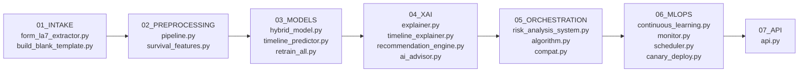

# NEXUS-XAI Backend: Sequential Pipeline Architecture

The files in `backend/` execute sequentially according to the following 7-phase data, machine learning, and serving lifecycle:

---

## Sequential Execution Breakdown

### Phase 1: Intake & Statutory Form Extraction (`01_INTAKE`)
- [`form_la7_extractor.py`](file:///c:/Users/Ishant%20Pandey/.gemini/antigravity-ide/scratch/SIh/backend/01_intake/form_la7_extractor.py): PDF intake parser using `pdfplumber` to extract statutory land acquisition parameters from official Form LA-7 documents.
- [`build_blank_template.py`](file:///c:/Users/Ishant%20Pandey/.gemini/antigravity-ide/scratch/SIh/backend/01_intake/build_blank_template.py): Compiles official blank Form LA-7 templates and sample variants.

### Phase 2: Preprocessing & Feature Engineering (`02_PREPROCESSING`)
- [`pipeline.py`](file:///c:/Users/Ishant%20Pandey/.gemini/antigravity-ide/scratch/SIh/backend/02_preprocessing/pipeline.py): Scikit-learn preprocessing transformers, log scalers, out-of-fold target encoders, and SMOTE-NC balancing.
- [`survival_features.py`](file:///c:/Users/Ishant%20Pandey/.gemini/antigravity-ide/scratch/SIh/backend/02_preprocessing/survival_features.py): Computes time-to-event statutory lapse flags and Section 19(7) censoring indicators.

### Phase 3: Dual-Paradigm Modeling & Training (`03_MODELS`)
- [`hybrid_model.py`](file:///c:/Users/Ishant%20Pandey/.gemini/antigravity-ide/scratch/SIh/backend/03_models/hybrid_model.py): **Paradigm 1** — Stacking Ensemble (XGBoost, LightGBM, CatBoost, ExtraTrees) with Logistic Regression Meta-Learner and Platt Scaling.
- [`timeline_predictor.py`](file:///c:/Users/Ishant%20Pandey/.gemini/antigravity-ide/scratch/SIh/backend/03_models/timeline_predictor.py): **Paradigm 2** — Random Survival Forest (RSF) & DeepSurv neural survival modeling.
- [`retrain_all.py`](file:///c:/Users/Ishant%20Pandey/.gemini/antigravity-ide/scratch/SIh/backend/03_models/retrain_all.py) & [`retrain_pipeline.py`](file:///c:/Users/Ishant%20Pandey/.gemini/antigravity-ide/scratch/SIh/backend/03_models/retrain_pipeline.py): Orchestrates model retraining.
- [`train_timeline.py`](file:///c:/Users/Ishant%20Pandey/.gemini/antigravity-ide/scratch/SIh/backend/03_models/train_timeline.py): Trains Random Survival Forests.
- [`evaluate_model.py`](file:///c:/Users/Ishant%20Pandey/.gemini/antigravity-ide/scratch/SIh/backend/03_models/evaluate_model.py) & [`evaluate_model_comprehensive.py`](file:///c:/Users/Ishant%20Pandey/.gemini/antigravity-ide/scratch/SIh/backend/03_models/evaluate_model_comprehensive.py): Multi-objective evaluation & Optuna NSGA-II optimization.

### Phase 4: Explainability & Prescriptive Mitigation (`04_XAI`)
- [`explainer.py`](file:///c:/Users/Ishant%20Pandey/.gemini/antigravity-ide/scratch/SIh/backend/04_xai/explainer.py): TreeSHAP localized attribution decomposition.
- [`timeline_explainer.py`](file:///c:/Users/Ishant%20Pandey/.gemini/antigravity-ide/scratch/SIh/backend/04_xai/timeline_explainer.py): Permutation-based timeline survival explainer.
- [`recommendation_engine.py`](file:///c:/Users/Ishant%20Pandey/.gemini/antigravity-ide/scratch/SIh/backend/04_xai/recommendation_engine.py): Prescriptive interventions mapped to statutory RFCTLARR schedules with expected ROI.
- [`ai_advisor.py`](file:///c:/Users/Ishant%20Pandey/.gemini/antigravity-ide/scratch/SIh/backend/04_xai/ai_advisor.py): Domain-grounded conversational advisory assistant.

### Phase 5: System Orchestration (`05_ORCHESTRATION`)
- [`risk_analysis_system.py`](file:///c:/Users/Ishant%20Pandey/.gemini/antigravity-ide/scratch/SIh/backend/05_orchestration/risk_analysis_system.py): Multi-threaded unified orchestrator coordinating intake, predictions, XAI, and mitigations.
- [`algorithm.py`](file:///c:/Users/Ishant%20Pandey/.gemini/antigravity-ide/scratch/SIh/backend/05_orchestration/algorithm.py): Statutory risk classification under RFCTLARR Act 2013 (Section 19 lapse horizon, solatium, PAF thresholds).
- [`compat.py`](file:///c:/Users/Ishant%20Pandey/.gemini/antigravity-ide/scratch/SIh/backend/05_orchestration/compat.py): Compatibility shims for legacy estimators and environments.

### Phase 6: Autonomous MLOps & Continuous Learning (`06_MLOPS`)
- [`continuous_learning.py`](file:///c:/Users/Ishant%20Pandey/.gemini/antigravity-ide/scratch/SIh/backend/06_mlops/continuous_learning.py): Ingestion, PSI drift monitoring, triple validation gates, and version management.
- [`monitor.py`](file:///c:/Users/Ishant%20Pandey/.gemini/antigravity-ide/scratch/SIh/backend/06_mlops/monitor.py) & [`monitor_daemon.py`](file:///c:/Users/Ishant%20Pandey/.gemini/antigravity-ide/scratch/SIh/backend/06_mlops/monitor_daemon.py): Real-time drift surveillance engine.
- [`scheduler.py`](file:///c:/Users/Ishant%20Pandey/.gemini/antigravity-ide/scratch/SIh/backend/06_mlops/scheduler.py): APScheduler daemon scheduling daily midnight drift scans (`00:00`) and weekly retrains.
- [`canary_deploy.py`](file:///c:/Users/Ishant%20Pandey/.gemini/antigravity-ide/scratch/SIh/backend/06_mlops/canary_deploy.py): Safety validator for automated hot-reloading of retrained weights.

### Phase 7: API Gateway & Serving (`07_API`)
- [`api.py`](file:///c:/Users/Ishant%20Pandey/.gemini/antigravity-ide/scratch/SIh/backend/07_api/api.py): FastAPI REST gateway (port `8000`), JWT authentication, rate limiting, and SQLite persistence.
