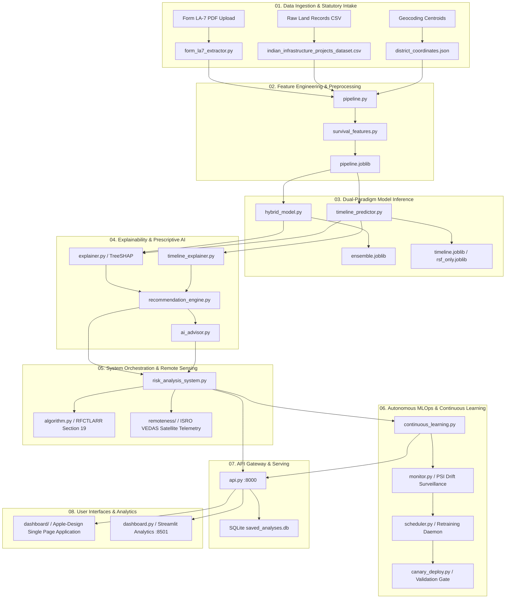

# NEXUS-XAI: Sequential Execution Pipeline & File Architecture

This document outlines the sequential data, machine learning, and operational workflow of the **NEXUS-XAI** platform, mapping each file to its exact stage in the pipeline.

---

## Sequential Stages Breakdown

### 01. Data Ingestion & Statutory Intake
- [`form_la7_extractor.py`](file:///c:/Users/Ishant%20Pandey/.gemini/antigravity-ide/scratch/SIh/form_la7_extractor.py): Extracts statutory land acquisition parameters from official Form LA-7 PDFs.
- [`build_blank_template.py`](file:///c:/Users/Ishant%20Pandey/.gemini/antigravity-ide/scratch/SIh/build_blank_template.py): Compiles official blank Form LA-7 templates.
- [`indian_infrastructure_projects_dataset.csv`](file:///c:/Users/Ishant%20Pandey/.gemini/antigravity-ide/scratch/SIh/indian_infrastructure_projects_dataset.csv): Central continuous learning dataset (13,730+ historical project records).
- [`district_coordinates.json`](file:///c:/Users/Ishant%20Pandey/.gemini/antigravity-ide/scratch/SIh/district_coordinates.json): Authentic Survey of India coordinates and centroid mappings for all 700+ Indian districts.

### 02. Preprocessing & Feature Engineering
- [`pipeline.py`](file:///c:/Users/Ishant%20Pandey/.gemini/antigravity-ide/scratch/SIh/pipeline.py): Leak-free scikit-learn transformers, log scalers, out-of-fold target encoding, and SMOTE-NC balancing.
- [`survival_features.py`](file:///c:/Users/Ishant%20Pandey/.gemini/antigravity-ide/scratch/SIh/survival_features.py): Computes time-to-event statutory lapse flags and Section 19(7) censoring indicators.
- [`pipeline.joblib`](file:///c:/Users/Ishant%20Pandey/.gemini/antigravity-ide/scratch/SIh/pipeline.joblib): Serialized production preprocessing pipeline weights.

### 03. Dual-Paradigm Modeling
- [`hybrid_model.py`](file:///c:/Users/Ishant%20Pandey/.gemini/antigravity-ide/scratch/SIh/hybrid_model.py): **Paradigm 1** — Stacking Ensemble (XGBoost, LightGBM, CatBoost, ExtraTrees) with Logistic Regression Meta-Learner and Platt Scaling.
- [`timeline_predictor.py`](file:///c:/Users/Ishant%20Pandey/.gemini/antigravity-ide/scratch/SIh/timeline_predictor.py): **Paradigm 2** — Random Survival Forest (RSF) & DeepSurv neural survival modeling.
- [`retrain_all.py`](file:///c:/Users/Ishant%20Pandey/.gemini/antigravity-ide/scratch/SIh/retrain_all.py) / [`retrain_pipeline.py`](file:///c:/Users/Ishant%20Pandey/.gemini/antigravity-ide/scratch/SIh/retrain_pipeline.py) / [`train_timeline.py`](file:///c:/Users/Ishant%20Pandey/.gemini/antigravity-ide/scratch/SIh/train_timeline.py): Model training and weight serialization routines.
- [`ensemble.joblib`](file:///c:/Users/Ishant%20Pandey/.gemini/antigravity-ide/scratch/SIh/ensemble.joblib), [`timeline.joblib`](file:///c:/Users/Ishant%20Pandey/.gemini/antigravity-ide/scratch/SIh/timeline.joblib), [`rsf_only.joblib`](file:///c:/Users/Ishant%20Pandey/.gemini/antigravity-ide/scratch/SIh/rsf_only.joblib): Production model checkpoints.

### 04. Explainability & Prescriptive Mitigation
- [`explainer.py`](file:///c:/Users/Ishant%20Pandey/.gemini/antigravity-ide/scratch/SIh/explainer.py): TreeSHAP localized attributions and waterfall breakdowns.
- [`timeline_explainer.py`](file:///c:/Users/Ishant%20Pandey/.gemini/antigravity-ide/scratch/SIh/timeline_explainer.py): Permutation feature importance and survival degradation attributions.
- [`recommendation_engine.py`](file:///c:/Users/Ishant%20Pandey/.gemini/antigravity-ide/scratch/SIh/recommendation_engine.py): Actionable RFCTLARR statutory interventions with expected delay reductions and financial ROI.
- [`ai_advisor.py`](file:///c:/Users/Ishant%20Pandey/.gemini/antigravity-ide/scratch/SIh/ai_advisor.py): Domain-grounded conversational advisory assistant with prompt sanitization.

### 05. System Orchestration & Remote Sensing
- [`risk_analysis_system.py`](file:///c:/Users/Ishant%20Pandey/.gemini/antigravity-ide/scratch/SIh/risk_analysis_system.py): Core multi-threaded orchestrator uniting preprocessing, prediction, XAI, and recommendations.
- [`algorithm.py`](file:///c:/Users/Ishant%20Pandey/.gemini/antigravity-ide/scratch/SIh/algorithm.py): Statutory risk scoring algorithms under RFCTLARR Act 2013 (Section 19 lapse horizon, solatium, PAF thresholds).
- [`remoteness/`](file:///c:/Users/Ishant%20Pandey/.gemini/antigravity-ide/scratch/SIh/remoteness): ISRO VEDAS satellite terrain detection, elevation analysis, and accessibility scoring.

### 06. Autonomous MLOps & Continuous Learning
- [`continuous_learning.py`](file:///c:/Users/Ishant%20Pandey/.gemini/antigravity-ide/scratch/SIh/continuous_learning.py): Ingestion, PSI drift monitoring, triple validation gates, and version management (`models/`).
- [`monitor.py`](file:///c:/Users/Ishant%20Pandey/.gemini/antigravity-ide/scratch/SIh/monitor.py) & [`monitor_daemon.py`](file:///c:/Users/Ishant%20Pandey/.gemini/antigravity-ide/scratch/SIh/monitor_daemon.py): Real-time drift surveillance engine.
- [`scheduler.py`](file:///c:/Users/Ishant%20Pandey/.gemini/antigravity-ide/scratch/SIh/scheduler.py): APScheduler daemon scheduling daily midnight drift scans (`00:00`) and weekly retrains.
- [`canary_deploy.py`](file:///c:/Users/Ishant%20Pandey/.gemini/antigravity-ide/scratch/SIh/canary_deploy.py): Safety validator for automated hot-reloading of retrained model weights.

### 07. API Gateway & Storage
- [`api.py`](file:///c:/Users/Ishant%20Pandey/.gemini/antigravity-ide/scratch/SIh/api.py): FastAPI REST gateway (port `8000`), JWT authentication, rate limiting, and SQLite persistence.
- [`saved_analyses.db`](file:///c:/Users/Ishant%20Pandey/.gemini/antigravity-ide/scratch/SIh/saved_analyses.db): Persistent SQLite store for saved project assessments.

### 08. User Interfaces & Visualizations
- [`dashboard/`](file:///c:/Users/Ishant%20Pandey/.gemini/antigravity-ide/scratch/SIh/dashboard): Single Page Application (SPA) frontend with Leaflet GIS Cartography, Survey of India GeoJSONs, and interactive predictors.
- [`dashboard.py`](file:///c:/Users/Ishant%20Pandey/.gemini/antigravity-ide/scratch/SIh/dashboard.py): Streamlit exploratory analytics application (port `8501`).

---

## Directory Organization Reference

| Directory | Purpose | Contents |
| :--- | :--- | :--- |
| `tests/unit/` | Automated Unit Tests | 17 comprehensive unit test modules run via `pytest` |
| `tests/` | Integration & E2E Tests | Puppeteer/Playwright browser automation and GIS tests |
| `audits/` | Auditing & Benchmarking | Audit runners (`audit_*.py`), XAI benchmark, and Markdown audit reports |
| `scripts/` | Operational Utilities | Metrics generation, test variant creation, model card generators |
| `remoteness/` | Remote Sensing Engine | ISRO VEDAS satellite API client, terrain classifier, terrain cache |
| `dashboard/` | Web Application Frontend | HTML5/JS/CSS assets, Survey of India GeoJSON maps, and report templates |
| `models/` | Model Version Store | Production model checkpoints, version tags, and `active_version.json` |
